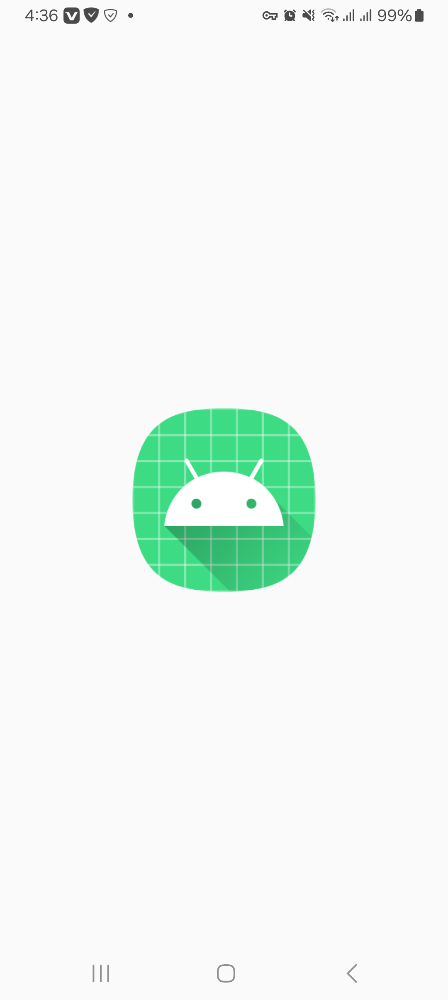
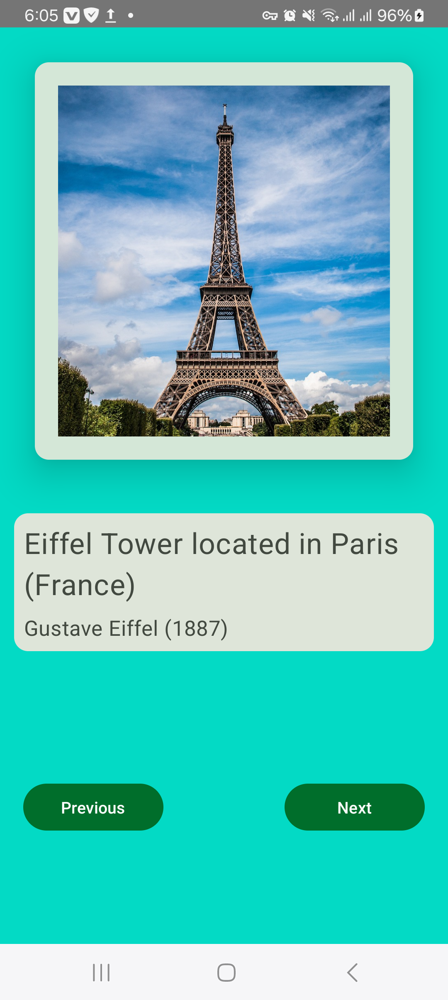
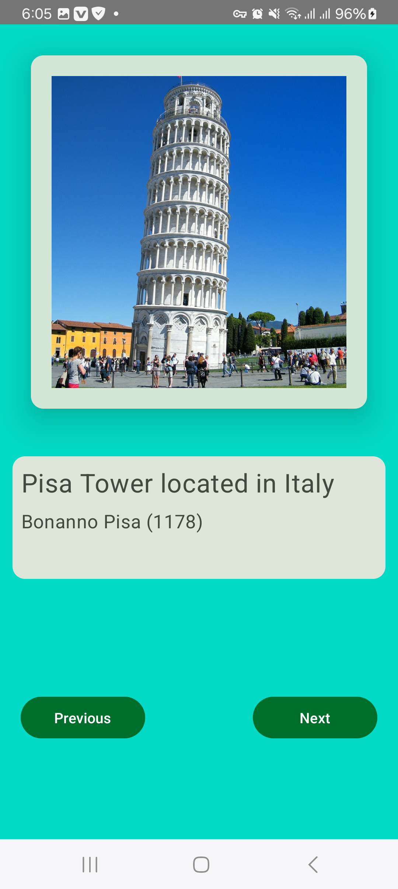
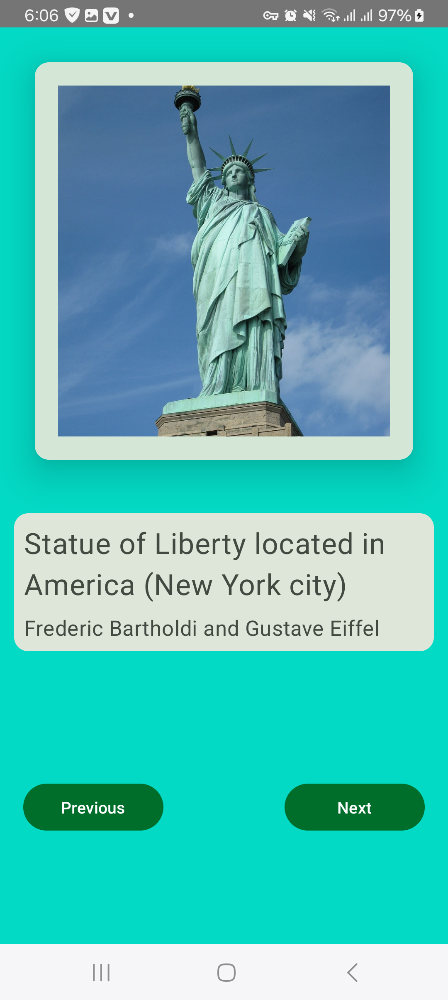
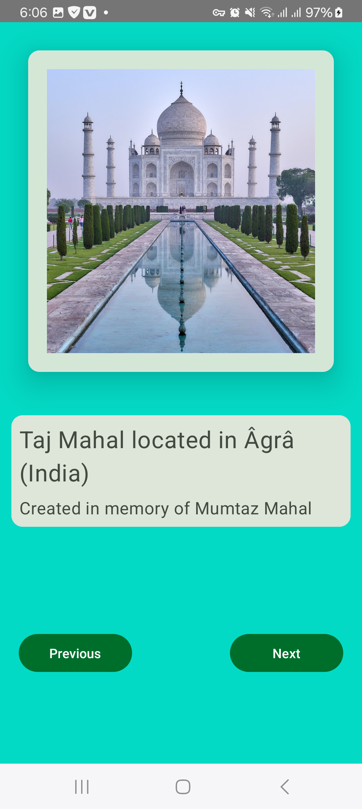
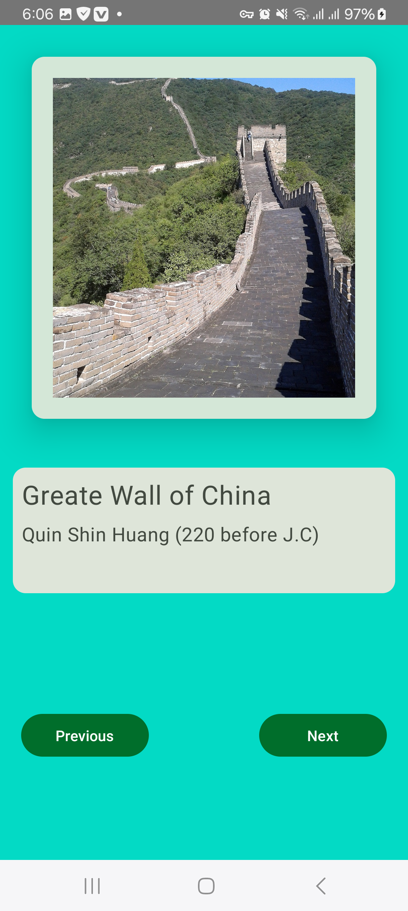

# Gallery Art app
Gallery Art est une application Android simple et intuitive qui vous permet de découvrir des monuments et des œuvres d'art célèbres du monde entier. Explorez une galerie d'images de sites emblématiques comme la Tour Eiffel, la Statue de la Liberté, et le Taj Mahal, avec des informations concises sur leur emplacement et leur histoire.
# ScreenShots
     

## 🛠️ Technologies utilisées

- Langage de programmation : Kotlin

- IDE : Android Studio

- Bibliothèques et frameworks : JetPack-Compose et Material Design

## ⚙️ Installation
1. Clonez le dépôt
2. Ouvrez le projet avec Android Studio :
- Lancez Android Studio.
- Allez dans File -> Open et sélectionnez le dossier racine du projet cloné.
3. Synchronisez avec Gradle :
- Une fois le projet ouvert, Android Studio devrait vous demander automatiquement de synchroniser les fichiers Gradle. Si ce n'est pas le cas, cliquez sur l'icône de synchronisation !
- Assurez-vous d'être connecté à internet pour que Gradle puisse télécharger toutes les dépendances nécessaires.
4. Exécutez l'application :
- Sélectionnez un émulateur ou connectez votre appareil physique.
- Cliquez sur le bouton Run (le triangle vert) dans la barre d'outils d'Android Studio.

## 🤝 Contribution
Ce projet est open-source. Les contributions, les signalements de bugs et les suggestions d'amélioration sont les bienvenus. N'hésitez pas à créer une pull request ou une issue sur le dépôt GitHub.

## 🖼️ Attribution des images
Certaines images utilisées dans cette application ne m'appartiennent pas. Elles ont été sélectionnées à partir de sources disponibles publiquement et sont utilisées dans un but de démonstration uniquement.
